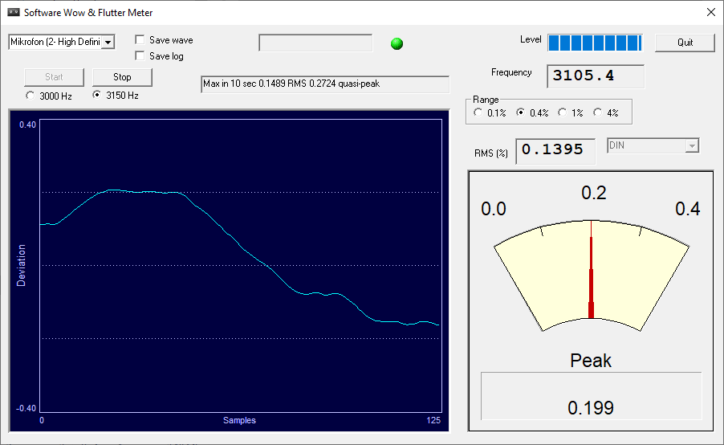

# Wow & Flutter Analyzer (WFGUI)

A software wow & flutter meter for Windows. Play a 3 kHz test tape into your
sound card and it measures your tape deck's speed accuracy and short-term speed
stability — no hardware W&F meter required.

Originally written by **Alex Freed**, who released it as free donationware and
[invited others to continue it](https://www.tapeheads.net/threads/version-8-of-the-wfgui.55581/post-775509961).



---

## Quick start

1. Connect **deck line out → PC line in** with an RCA-to-3.5 mm cable
   ([like this one](docs/IMG_3288.jpeg)). **Plug it in before launching** — on
   many machines the input only exists once a jack is inserted, and WFGUI exits
   with *"NO Input Devices Found.."* if it sees none.
2. Launch, and pick your input in the top-left dropdown.
3. Select **3000 Hz** or **3150 Hz** to match your test tape.
4. Select the weighting — **`DIN` for a standard measurement**. Set it *before*
   pressing Start; it locks while running.
5. Press **Start** and play the tape. Adjust level until the LED stays green.

You now have three numbers: **Frequency** (speed), **RMS (%)**, and the needle
(**quasi-peak**). Which one to quote depends on the standard — see
[Matching manufacturer specs](#matching-manufacturer-specs).

## What you need

| | |
|---|---|
| **Test tape** | A **3.00 kHz** or **3.15 kHz** tone. This is essential — a 1 kHz tone will not work. |
| **Line input** | Line in preferred; mic in works but is noisier. Many modern PCs have no line input at all — a cheap USB interface solves it. |
| **Cable** | RCA → 3.5 mm stereo. |
| **Windows** | Also runs under Wine on Linux/macOS — see [Building & running](#building--running). |

Your deck must be within **±5% of nominal speed** or the meter will not read at
all.

**Which channel gets measured.** WFGUI asks Windows for a fixed 44.1 kHz /
16-bit / **mono** stream and does no channel selection or mixing of its own — it
never sees a stereo signal to choose from. What lands in that mono stream is
therefore up to your sound card's driver: most commonly the **left** channel,
though some devices sum left and right instead.

In practice this means **feed the channel you want to measure into the left
input**. If you need to be sure which one you are getting, play the tape with
only one channel connected and check that the Frequency box still reads — then
swap. It matters more than it sounds: a deck can have measurably different W&F
on its two channels, and summing two channels of an azimuth-misaligned deck can
partially cancel the very modulation you are trying to measure.

## What wow & flutter actually is

If transport speed varies, pitch varies — so wow & flutter is **frequency
modulation of the recorded tone**. Measuring it means recovering that modulation
and metering it.

- **Wow** — variation below ~6 Hz, from large rotating parts.
- **Flutter** — variation above ~6 Hz, from small ones.

A part rotating *n* times per second produces a component at *n* Hz. That fact is
what makes the [spectrum analysis](#finding-the-guilty-part) below able to name
the failing component.

The percentage is the frequency deviation as a proportion of the carrier: at
3 kHz, **0.1% = 3 Hz deviation**.

## Reading the display

| Element | Meaning |
|---|---|
| **Frequency** | Measured carrier, updated once per second → **tape speed** |
| **RMS (%)** | RMS over the last 1 second |
| Needle / **Peak** | Live quasi-peak, ~1 s decay (the DIN-style ballistic) |
| **Max in 10 sec … RMS … quasi-peak** | Maxima of both over a rolling 10 s window |
| Weighting dropdown | `Unweighted` · `DIN` · `Wow` · `Flutter` |
| **Range** 0.1 / 0.4 / 1 / 4% | Full-scale for graph and needle — display only |
| Green LED | Lit only while the signal is valid |
| Deviation graph | Instantaneous weighted deviation, in % |

**Speed error** is simply the frequency reading against nominal:

```
speed error % = (displayed frequency / nominal − 1) × 100
```

In the screenshot above: 3105.4 Hz against 3150 Hz nominal = **−1.42%**, a deck
running slow.

> The `DIN` entry names the **weighting curve**, not the detector — it is the
> standard ~4 Hz-peaked curve used by *all* the standards. `Wow` and `Flutter`
> restrict the measurement to one band each; they are diagnostics, not standard
> readings.

## Matching manufacturer specs

Most people are here to compare against a spec sheet. The standards differ only
in **detector and time constant** — the weighting curve is the same in all of
them:

| Standard | Detector | Reads |
|---|---|---|
| **IEC / DIN / CCIR** | weighted peak | highest |
| **NAB** | unweighted rms | lower |
| **JIS** (a.k.a. **WRMS**) | weighted rms, slow | lowest |

WFGUI computes both detectors at once, so the standard you get is determined by
the weighting you select plus **which number you read**:

| Spec is quoted as | Set weighting to | Read |
|---|---|---|
| **DIN / IEC / CCIR** | `DIN` | the needle / quasi-peak |
| **WRMS / JIS** | `DIN` | the **RMS (%)** box |
| **NAB / unweighted RMS** | `Unweighted` | the **RMS (%)** box |

Expect **DIN to read roughly 2–3× the WRMS figure** for the same machine. If a
spec sheet's number looks impossibly good, check which standard it is in — JIS
weighting was often chosen precisely because it flattered the result.

**Before trusting a comparison:**

- **The test tape dominates the result.** Absolute numbers mean little unless the
  same tape is used throughout. On an excellent deck the tape may well be the
  worse of the two.
- Manufacturers quote hand-picked, carefully adjusted samples.
- Many specs are **2-sigma** (the value exceeded only 5% of the time). WFGUI has
  no 2-sigma mode, and its 10-second *maximum* will read higher than one.
- JIS's "slow" detector is approximated here by a 1-second RMS.

## Getting trustworthy numbers

- **Measure your noise floor first.** Generate a 3 kHz tone on the PC, loop it
  from output back to input, and measure. That is your rig's floor — anything
  near it is your sound card, not your deck. A clean setup reaches ~0.0025% RMS,
  against ~0.04–0.05% for a good cassette deck.
- **Measure at the beginning, middle and end of the tape.** W&F varies
  considerably along a cassette.
- **Never measure in simultaneous record-reproduce (3-head) mode.** The
  record-to-replay head delay creates a comb filter that makes the measurement
  blind to flutter at certain frequencies, giving falsely low readings. Record,
  rewind, *then* play back.
- Speed error and W&F are measured together, from the same pass.

## Advanced

### Logging along the whole tape

Ticking **Save log** before Start writes `log.txt` once per second — three
space-separated columns: **frequency**, **1-second RMS**, **max quasi-peak over
the last 10 s**. Open Excel first, then File → Open → Text Files (switching the
filter off `*.xls`), and it parses into three columns.

Plotting those against time across a full cassette is the single best view of a
transport's health — it will show a stretched belt, a failing idler, or a deck
that drifts as the tape pack changes.

> **Known limitation:** the *Save log* checkbox is **not wired up in this
> source** — the underlying flag is never set, so a binary built from this
> repository never writes `log.txt`. The released v8 binary
> (`wfgui_8_60.zip`, included here) does log correctly. A fix is tracked
> separately.

### Finding the guilty part

Ticking **Save wave** writes `WF_out.dat` — the demodulator's raw output, which
is what you run a spectrum analysis on to work out *which part* is at fault.

**What is actually stored**

| | |
|---|---|
| Quantity | half-period error: `10 × (nominal − measured)`, in nanoseconds |
| One count | 0.1 ns of half-period error |
| Sign | **positive = running fast** (measured half-period shorter than nominal) |
| Format | headerless, signed **16-bit**, **mono**, little-endian |
| Sample rate | **2 × carrier** — **6000 Hz** for a 3000 Hz tone, **6300 Hz** for 3150 Hz |

It is **not** a frequency, and **not** a percentage. To convert a count to the
percentage the meter displays, divide by the nominal half-period in nanoseconds
over ten:

```
W&F %  =  count ÷ 15873      (3150 Hz tone)
W&F %  =  count ÷ 16667      (3000 Hz tone)
```

**Range limit.** A signed 16-bit sample caps at ±32767, which is only **±2.06%**
at 3150 Hz (±1.97% at 3000 Hz) — while the meter itself accepts anything within
±5% of nominal. A deck running 2–5% off speed therefore reads normally on screen
but cannot be captured accurately.

Samples are clamped at that limit rather than allowed to wrap, and the status
line reads **`Capture clipped`** for the rest of the run once it happens. A
clipped capture is railed and obviously unusable; treat it as a signal to correct
gross speed error and measure again, not as data. Older builds wrapped instead,
producing files that looked entirely plausible and were not.

**Two properties worth understanding**

- **It is written before the weighting filter.** The contents do not depend on
  the dropdown — DIN, Wow, Flutter and Unweighted all produce an identical file.
  That matters, because the weighting curves are deliberately lossy: DIN peaks at
  4 Hz and rolls off hard either side, and `Wow` discards everything above 6 Hz
  outright. Analysing a weighted signal would mean hunting for a fault in data
  that had already thrown the evidence away. Rotating parts turn at whatever rate
  they turn at, not at perceptually-weighted rates.
- **The sample rate is tied to the carrier, not to audio.** One sample per zero
  crossing, and a sine crosses zero twice per cycle — hence 2 × carrier. Set the
  wrong rate on import and every frequency you read off the spectrum is scaled by
  the ratio. This is the single most common way to misread the file.

**Intended use — finding the faulty part**

1. Audacity → File → Import → Raw Data, with `Signed 16-bit PCM`,
   `Little-endian`, `1 Channel (Mono)`, and the sample rate above.
2. **Remove the DC offset first**: Effect → Normalize, with *Remove DC offset*
   ticked. The DC component is the deck's static speed error, and left in place
   it leaks across the low-frequency bins — which is precisely the wow band you
   are trying to read.
3. Analyze → Plot Spectrum, `Size: 65536`, `Axis: Log frequency`. That gives
   ~0.1 Hz resolution and needs about 10 seconds of capture selected.

Each peak is a rotating part, and its circumference follows from the tape speed:

```
circumference = tape speed ÷ peak frequency
```

At cassette speed (4.76 cm/s), a peak at 5 Hz is a part of roughly 0.95 cm
circumference — enough to tell a capstan from an idler from a motor. Read the
peaks relative to each other; take absolute W&F percentages from the meter, not
from here.

> Both files are written to the program's working directory, and neither
> overwrites the previous run: if `WF_out.dat` already exists the next capture
> becomes `WF_out_1.dat`, then `WF_out_2.dat`, and `log.txt` behaves the same
> way. The app does not announce which name it settled on, so check the folder
> after several runs. If the files seem to vanish entirely, see Troubleshooting.

## Troubleshooting

| Symptom | Cause / fix |
|---|---|
| **"NO Input Devices Found.."**, then exits | No input device present. Plug the cable in *before* launching. Check the machine actually has a line input; add a USB interface if not. |
| **"Capture clipped"** in the status line | The deck is more than ~2% off nominal speed, beyond what the capture file can represent. The meter readings are still valid; the `WF_out.dat` capture is not. Correct the speed and measure again. |
| **"Signal too low"** never clears | Input below roughly −56 dBFS. Check level and that the input is enabled in Windows sound settings and privacy settings. Most often, though, it is the next row. |
| **Wrong input used, whatever you select** | Known bug: the dropdown is sorted alphabetically but its *position* is passed to the sound API as the *device number*, so the two disagree. **Try the other entries** until one works — the one that works may be labelled something unrelated. |
| **Dropdown shows only one line** | The list is there but drawn one item tall. Scroll it with the **mouse wheel** or the **arrow keys**. |
| **Weighting can't be changed** | It locks on Start and is not released on Stop. Set it before starting, or restart the app. |
| **`log.txt` / `WF_out.dat` missing** | Written to the working directory. Under UAC, writes into `Program Files` are silently redirected to `C:\Users\<you>\AppData\Local\VirtualStore\...`. **Run it from an ordinary user-writable folder.** (For `log.txt`, also see the limitation above.) |
| Frequency shows a value but nothing else updates | Tone is more than ±5% off nominal, or the 3000/3150 setting doesn't match the tape. |
| Vendor audio drivers misbehaving | Uninstalling the vendor driver in favour of the generic Windows one has fixed this for Focusrite interfaces. |

## Building & running

Windows, Visual Studio Build Tools with the **VC++ ATL/MFC** component:

```
msbuild wfgui.vcxproj /p:Configuration=Release /p:Platform=Win32
```

CI builds this on every push and publishes the executable as an artifact; tagged
pushes (`v*`) publish a GitHub Release. MFC and the CRT are linked statically, so
the result is a single self-contained `.exe`.

**Wine (Linux/macOS):** works, but fails *silently* if `MFC42.DLL` is missing —
place that DLL next to the executable. `WINEDEBUG=+dll` will show what is
missing.

**Prebuilt originals** are in the repo: `wfgui_4_60.zip`, `wfgui_7_60.zip`,
`wfgui_8_60.zip`.

> This source tree's About box still reads "Version 3.0" although it carries
> v8-era features, and it differs from the released v8 in at least one respect
> (logging, above). Where this README describes behaviour, it describes **this
> source**.

## Credits & further reading

- **Alex Freed** — original author.
- **A.N.T.** — distributed v8 and maintained the community thread.
- [Version 8 of the WFGUI](https://www.tapeheads.net/threads/version-8-of-the-wfgui.55581/)
  — the tapeheads thread, the source of most practical knowledge here.
- Bob Metzler, *Audio Measurement Handbook*, "Wow and Flutter Measurements" —
  the standards, the weighting curve, and measurement technique.

Detailed extraction notes behind this document are in [`docs/knowledge/`](docs/knowledge/).
